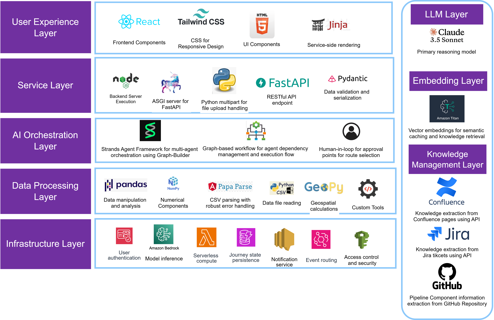

# Multi-Agent AI Logistics Orchestrator for Shipment Exception Resolution

**Predictive, Proactive, Autonomous Maritime Exception Management**

> A cutting-edge AI-powered system that predicts shipment delays 24-72 hours in advance and autonomously resolves maritime logistics exceptions using collaborative AI agents.

📺 **[Watch Demo Video](https://youtu.be/mvinerePl28)**

---

## 🎯 Problem Statement

The maritime logistics industry faces significant challenges that impact customer satisfaction and operational efficiency:

- **15%** of US shipments are delayed annually, affecting **70%** of consumers
- Port congestion reaches up to **132%**, causing delays of **0.4 to 10 days**
- Weather-related disruptions cause **23%** of trucking delays and **30%** of shipment exceptions
- **80%** of shippers lack real-time visibility, leading to reactive exception handling
- Customer trust erodes rapidly—**40%** of customers stop buying after poor delivery experiences
- Manual decision-making increases costs due to lack of autonomous optimization

---

## 💡 Solution Approach

Our Multi-Agent AI Orchestrator addresses these challenges through an intelligent, autonomous system:

### Core Capabilities

- **🤖 Autonomous Agents**: Six specialized AI agents collaborate via AWS Bedrock and Nova with minimal human intervention
- **⚠️ Anomaly Alerts**: Predicts delays 24-72 hours in advance using live vessel tracking and ML models
- **🔄 Data Fusion**: Merges external data feeds (weather, marine traffic, news) with historical route data for intelligent decision-making
- **🗺️ Route Optimization**: Generates three cost-effective, eco-friendly route alternatives per exception
- **📢 Smart Notifications**: AWS SNS delivers clear, actionable updates to all stakeholders automatically
- **☁️ Serverless Infrastructure**: Lambda, DynamoDB, and CloudWatch ensure scalable, compliant operations

---

## 📊 Key Metrics & Benefits

| Metric | Value | Description |
|--------|-------|-------------|
| **Prediction Accuracy** | 85% | 24-72 hour advance exception alerts |
| **Response Time** | <15 mins | Rapid issue handling (vs 6-8 hrs traditional) |
| **Cost Savings** | $800 | Per shipment through optimized routing |
| **System Availability** | 99.9% | Reliable, always-on performance |

### Business Impact

- ✅ **Predictive Prevention**: Detects delays 24-72 hours early to reroute shipments proactively
- ✅ **Reduced Escalations**: 30% fewer customer complaints through transparent updates
- ✅ **Cost Optimization**: Avoids penalties via smart rerouting balancing speed and congestion
- ✅ **Sustainable Routing**: Minimizes carbon footprint without compromising delivery performance
- ✅ **Stronger Partnerships**: Shares real-time insights for collaborative issue resolution
- ✅ **Effortless Scaling**: Serverless AWS infrastructure handles any volume with zero maintenance

---

## 🏗️ Architecture Overview


### System Workflow

1. **User Input**: Web application receives shipment ID, origin, destination, and expected arrival date
2. **Forecast Agent**: Analyzes weather patterns, marine traffic, and news to recommend optimal routes
3. **User Selection**: Human-in-the-loop approves route from AI-generated options
4. **Detection Agent**: Monitors vessel position in real-time using AIS data
5. **Deviation Detection**: Identifies significant deviations from planned route
6. **Analysis Agent**: Performs root cause analysis using weather data, crew reports, and news sources
7. **Resolution Agent**: Provides route alternatives and optimization recommendations
8. **Port Monitor Agent**: Assesses destination port status, berth availability, and traffic conditions
9. **Communication Agent**: Sends notifications to stakeholders via AWS SNS
10. **Historical Storage**: Updates DynamoDB with journey status and route performance data

---

## 🛠️ Tech Stack



### Architecture Layers

<details>
<summary><b>User Experience Layer</b></summary>

- **Frontend Framework**: React, HTML5, CSS3
- **API Communication**: FastAPI
- **Template Engine**: Jinja2
- **Mapping**: Leaflet.js for interactive route visualization

</details>

<details>
<summary><b>Service Layer</b></summary>

- **API Gateway**: Node.js, Spring Boot
- **Backend Services**: Python FastAPI (in `/backend` folder)

</details>

<details>
<summary><b>Agentic AI Orchestration Layer</b></summary>

- **Agent Framework**: Strands Agent Framework
- **LLM Platform**: AWS Bedrock with Nova models
- **Caching**: Azure Cache for Redis

</details>

<details>
<summary><b>AI/ML Agent Layer</b></summary>

- **6 Specialized Agents**:
  - Forecast Agent (Weather analysis)
  - Detection Agent (Real-time tracking)
  - Analysis Agent (Root cause identification)
  - Resolution Agent (Route optimization)
  - Port Monitor Agent (Destination assessment)
  - Communication Agent (Stakeholder notifications)

</details>

<details>
<summary><b>RAG Layer</b></summary>

- **Vector Database**: Databricks Vector Search
- **Graph Database**: Neo4j for relationship mapping
- **Knowledge Base**: Historical route data, weather patterns, port information

</details>

<details>
<summary><b>Data Processing Layer</b></summary>

- **ETL Pipeline**: Databricks ETL
- **Data Lake**: Azure Data Lake Storage (ADLS)
- **Stream Processing**: Azure Event Hub
- **Multimodal Processing**: Azure Cognitive Services, Video Indexer, Azure Speech

</details>

<details>
<summary><b>Infrastructure Layer</b></summary>

- **Compute**: AWS Lambda (serverless functions), Azure Kubernetes Service (AKS)
- **Storage**: DynamoDB (NoSQL), Azure Data Lake
- **Networking**: Azure Virtual Network (VNET), Express Route
- **Security**: Azure Active Directory, AWS KMS
- **Resource Management**: Azure Resource Groups

</details>

<details>
<summary><b>Observability</b></summary>

- **Monitoring**: Azure Monitor, MLflow
- **API Management**: Azure APIM
- **Tracing**: Strands Agent traces for end-to-end workflow visibility

</details>

<details>
<summary><b>LLM</b></summary>

- **Primary**: AWS Bedrock Nova
- **Alternative**: OpenAI API integration

</details>

<details>
<summary><b>Operations</b></summary>

- **CI/CD**: Azure DevOps
- **Workflow Orchestration**: MLflow
- **Version Control**: GitHub

</details>

<details>
<summary><b>Governance</b></summary>

- **Data Catalog**: Unity Catalog (Databricks)
- **Compliance**: Automated PII detection and redaction
- **Audit Trails**: Complete lineage tracking

</details>

---

## 🔍 AI Explainability

Our system prioritizes transparency and trust through multiple explainability mechanisms:

### 1. Responsibility, Transparency, and Explainability
- **Automatic Content Filtering**: Strands Safety & Security automatically filters harmful content
- **PII Protection**: Detects and redacts personally identifiable information across all agent communications
- **Compliance**: Ensures regulatory adherence in maritime logistics operations

### 2. Human-in-the-Loop Approval
- **Final Route Selection**: Maintains human accountability for critical decisions
- **User Empowerment**: Users approve AI recommendations before execution
- **Audit Trail**: Complete record of human decisions vs AI suggestions

### 3. Real-Time Reasoning Logs
- **Plain Language Explanations**: Every agent action explained in non-technical terms
- **Decision Transparency**: Users understand why specific routes are recommended
- **Debugging Support**: Technical teams can trace decision paths

### 4. Strands Agent Traces
Comprehensive end-to-end workflow visibility showing:
- **Model Invocations**: Prompts, parameters, and token usage
- **Tool Executions**: Inputs, outputs, and processing times
- **Reasoning Steps**: Step-by-step agent decision logic

**Example Trace Output:**
```
[2025-10-22 14:32:01] Forecast Agent: Analyzing weather patterns...
[2025-10-22 14:32:02] Weather Tool: Retrieved NOAA data for 45°N, 50°W
[2025-10-22 14:32:03] Forecast Agent: Storm probability 78% detected
[2025-10-22 14:32:04] Reasoning: Recommending Route 2 due to favorable conditions
```

---

## 📈 Scalability

The system is designed for enterprise-scale operations with automatic resource scaling:

### 1. Event-Driven Lambda Functions
- **Automatic Horizontal Scaling**: AWS Lambda scales from zero to thousands of concurrent executions
- **Independent Agent Execution**: Each agent runs as a separate serverless function
- **Cost Efficiency**: Pay only for actual compute time used
- **Zero Maintenance**: No server management required

### 2. DynamoDB with On-Demand Capacity
- **Automatic Throughput Scaling**: Adjusts read/write capacity based on traffic
- **Journey Status Storage**: Maintains real-time shipment state across the system
- **Millisecond Latency**: Fast reads for real-time monitoring
- **Unlimited Scale**: Handles millions of shipments without manual intervention

### 3. Strands Agent Orchestration
- **Parallel Agent Execution**: Multiple Forecast, Detection, and Analysis agents process different shipments simultaneously
- **AWS Bedrock Integration**: Leverages managed AI infrastructure for model scaling
- **Intelligent Queueing**: Automatically manages agent workload distribution
- **Fault Tolerance**: Agents operate independently; failures are isolated

### Scalability Metrics
- **Concurrent Shipments**: 10,000+ simultaneous tracking operations
- **Agent Response Time**: <15 minutes even under peak load
- **System Availability**: 99.9% uptime SLA
- **Geographic Distribution**: Multi-region deployment for global coverage

---

## 🚀 Getting Started

### Prerequisites

- Node.js 18+ and npm
- Python 3.9+ (for backend)
- AWS Account with Bedrock access
- Azure subscription (for optional services)

### Installation

1. **Clone the repository**
```bash
   git clone https://github.com/your-org/shipment-exception-resolution.git
   cd shipment-exception-resolution
```

2. **Install frontend dependencies**
```bash
   npm install
```

3. **Set up backend** (Strands Agent framework)
```bash
   cd backend
   pip install -r requirements.txt
   # Configure AWS credentials and API keys
   # See backend/README.md for detailed setup
```

4. **Configure environment variables**
```bash
   cp .env.example .env
   # Edit .env with your AWS/Azure credentials
```

5. **Run the application**
   
   **Frontend:**
```bash
   npm run dev
   # or
   npm start
   # Opens at http://localhost:8000
```
   
   **Backend:** (in separate terminal)
```bash
   cd backend
   python app.py
   # API runs at http://localhost:5000
```

### Quick Start Demo

1. Navigate to `http://localhost:8000`
2. Click "Start Application" on the welcome screen
3. Log in with demo credentials (provided in `.env.example`)
4. Configure a test shipment:
   - **Shipment ID**: CARGO-2025-11-BST-PRT
   - **Origin**: Boston, USA
   - **Destination**: Porto, Spain
   - **Arrival Date**: November 3, 2025
5. Click "Initialize AI Analysis"
6. Watch the agents collaborate to forecast optimal routes
7. Select a route and start the journey simulation
8. Observe real-time deviation detection and resolution

---

## 📁 Project Structure
```
shipment-exception-resolution/
│
├── frontend/
│   ├── index.html              # Main HTML file
│   ├── styles.css              # Application styles
│   ├── app.js                  # Frontend logic & agent interactions
│   ├── package.json            # Frontend dependencies
│   └── README.md               # Frontend documentation
│
├── backend/                    # Strands Agent backend (Python)
│   ├── agents/                 # Individual agent implementations
│   │   ├── forecast_agent.py
│   │   ├── detection_agent.py
│   │   ├── analysis_agent.py
│   │   ├── resolution_agent.py
│   │   ├── port_monitor_agent.py
│   │   └── communication_agent.py
│   │
│   ├── tools/                  # Agent tools
│   │   ├── weather_tool.py
│   │   ├── marine_traffic_tool.py
│   │   ├── news_analyzer_tool.py
│   │   └── vessel_tracking_tool.py
│   │
│   ├── orchestrator/           # Strands orchestration logic
│   │   ├── agent_coordinator.py
│   │   └── workflow_engine.py
│   │
│   ├── config/                 # Configuration files
│   │   ├── aws_config.py
│   │   ├── agent_config.yaml
│   │   └── maritime_config.yaml
│   │
│   ├── app.py                  # FastAPI backend server
│   ├── requirements.txt        # Python dependencies
│   └── README.md               # Backend setup guide
│
├── docs/
│   ├── architecture.md         # Architecture documentation
│   ├── api-reference.md        # API documentation
│   └── agent-design.md         # Agent design patterns
│
├── infrastructure/             # AWS/Azure deployment configs
│   ├── terraform/              # Infrastructure as Code
│   └── cloudformation/         # AWS stack templates
│
├── tests/
│   ├── frontend/               # Frontend tests
│   └── backend/                # Backend agent tests
│
├── Shipment_Exception_Resolution_arch_diag_v2.png
├── .env.example                # Environment variables template
├── .gitignore
├── LICENSE
└── README.md                   # This file
```

---

## 🎮 Usage Guide

### 1. Initial Forecast

The **Forecast Agent** analyzes three potential routes considering:
- Weather patterns (NOAA/ECMWF data)
- Marine traffic density (AIS tracking)
- Maritime news and advisories
- Historical route performance

**Output**: Comprehensive report with route recommendations and risk assessments.

### 2. Route Selection

Human operator reviews AI-generated options and selects optimal route based on:
- Business priorities (cost vs speed)
- Customer commitments
- Environmental considerations

### 3. Journey Monitoring

**Detection Agent** continuously tracks:
- Real-time vessel position (AIS)
- Speed and heading deviations
- Progress against planned waypoints

**Triggers**: Alerts when vessel deviates significantly from expected coordinates.

### 4. Deviation Analysis

**Analysis Agent** performs root cause investigation:
- Correlates weather data with deviation
- Reviews crew reports and bridge logs
- Scans maritime news for relevant incidents
- Determines if deviation was justified

**Output**: Detailed analysis report with decision recommendation.

### 5. Route Adjustment

**Resolution Agent** evaluates options:
- Continue on adjusted course
- Revert to original route
- Select alternative route

**User Decision**: Human approves final course of action.

### 6. Port Assessment

**Port Monitor Agent** (activated near destination) checks:
- Berth availability and assignments
- Port traffic and congestion levels
- Weather conditions at destination
- Tug and pilot service availability

**Output**: Docking recommendation and timing optimization.

---

## 🔌 API Reference

### Backend Endpoints (FastAPI)

Detailed API documentation is available in the backend folder at `/backend/README.md`.

**Base URL**: `http://localhost:5000/api/v1`

#### Key Endpoints:
```
POST   /forecast/initialize      # Start forecast analysis
GET    /forecast/report          # Retrieve forecast report
POST   /route/select             # User selects route
GET    /journey/status           # Real-time journey status
POST   /deviation/analyze        # Trigger root cause analysis
GET    /port/assessment          # Port status and recommendations
POST   /notifications/send       # Send stakeholder updates
```

See `/backend/docs/api-reference.md` for complete endpoint documentation.

---

## 🧪 Testing

### Frontend Tests
```bash
npm run test
```

### Backend Tests
```bash
cd backend
pytest tests/ -v
```

### Integration Tests
```bash
npm run test:integration
```

---

## 🚢 Deployment

### AWS Deployment

1. **Configure AWS CLI**
```bash
   aws configure
```

2. **Deploy Infrastructure** (Terraform)
```bash
   cd infrastructure/terraform
   terraform init
   terraform plan
   terraform apply
```

3. **Deploy Backend** (Lambda Functions)
```bash
   cd backend
   ./deploy.sh production
```

4. **Deploy Frontend** (S3 + CloudFront)
```bash
   npm run build
   aws s3 sync build/ s3://your-bucket-name
```

### Docker Deployment
```bash
docker-compose up -d
```

---
## 📄 License

This project is licensed under the MIT License - see the [LICENSE](LICENSE) file for details.
